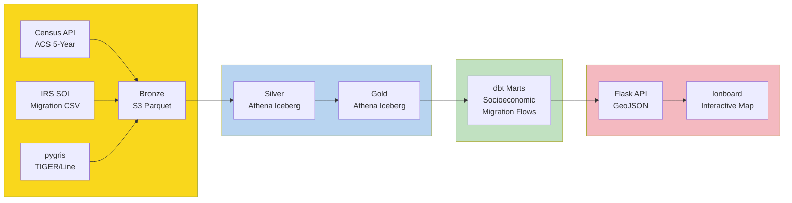
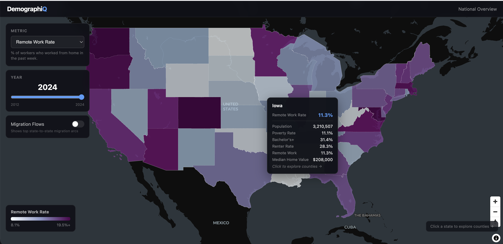
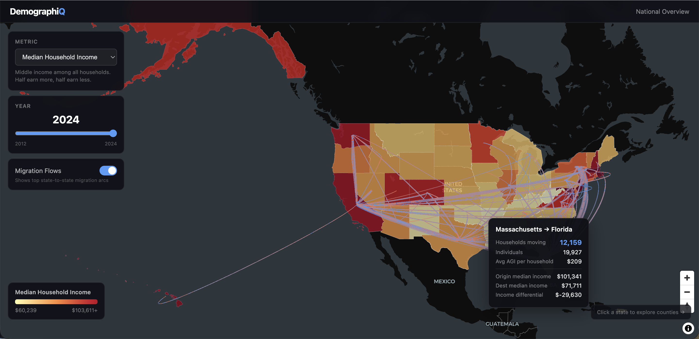
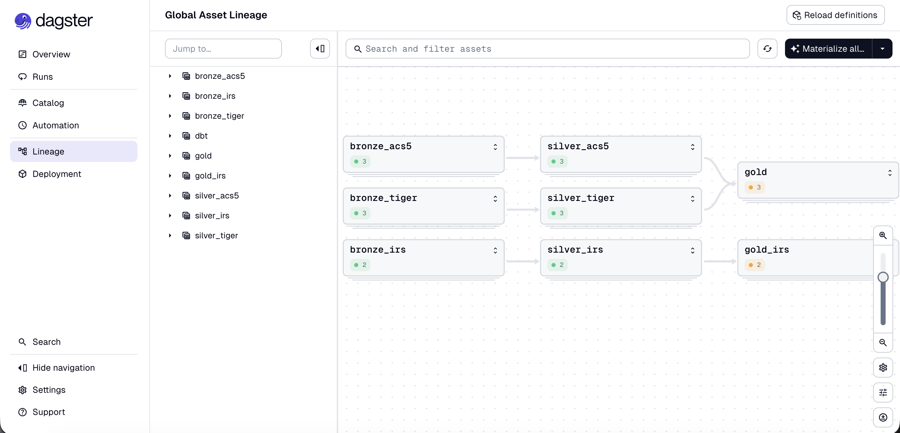
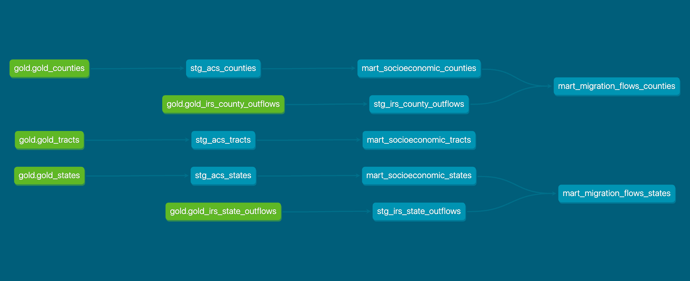
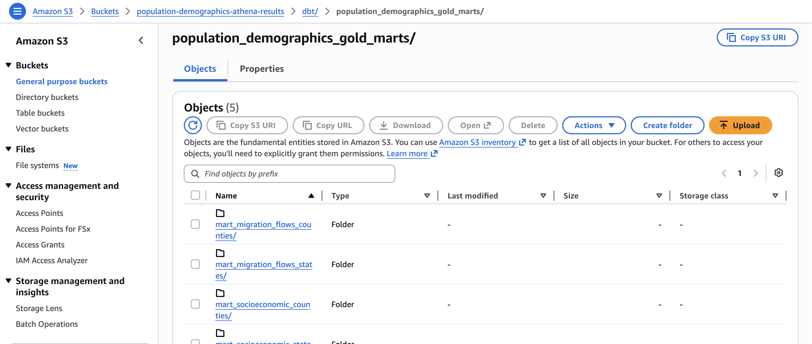

# DemographIQ - Socioeconomic Atlas


A data engineering platform for analyzing U.S. socioeconomic patterns across geographies and time.

Built on a modern **data lakehouse architecture** (with medaillion layers: *Bronze → Silver → Gold*), **DemographIQ** ingests,
transforms, and models **Census ACS**, **TIGER/Line**, and **IRS migration** data to uncover demographic
trends, economic mobility, and population movement across states, counties, and census tracts
**from 2012 to 2024**.

Little GIF demo of the platform:


**What you can do with it:**

- **Year range slider** — scrub through 2012–2024 to watch how metrics evolve over time
- **Metric selector** — choose from median household income, poverty rate, bachelor's+ rate, renter rate, remote work rate
- **Interactive choropleth map** — zoom from national overview → state → county → census tract level
- **Dynamic legend** — colormap rescales to the 5th–95th percentile of the currently visible geography
- **Migration flow arcs** — see origin/destination state pairs sized by household volume, colored by income differential
- **State/county/tract drill-down** — click any geography to zoom in and see finer-grained data for that area

<hr style="height: 3px; background: linear-gradient(to right, #a7aecf, #550aa0); border: none;">

### **Table of contents**

- [ADR (Architecture Decision Record) and tooling](#adr--and-tooling)
- [How to deploy the project](#how-to-deploy-the-project)
- [Data Sources](#data-sources)
- [What makes this project interesting](#what-makes-this-project-interesting)
- [Overview of Data Flow in Stages](#overview-of-data-flow-in-stages)
- [Infrastructure Setup (Terraform)](#infrastructure-setup-terraform)
- [Data Quality & Pipeline Observability (Dagster and dbt)](#data-quality--pipeline-observability-dagster-and-dbt)
- [Structured Logging with Dagster](#structured-logging-with-dagster)
- [Pipeline Automation (No Cron Schedules)](#pipeline-automation-no-cron-schedules)
- [Data Modeling with dbt](#data-modeling-with-dbt)
- [Project Structure](#project-structure)
- [Virtual Environments](#virtual-environments)
- [Potential improvements to make this project closer to "production grade"](#potential-improvements-to-make-this-project-closer-to-production-grade)


<hr style="height: 3px; background: linear-gradient(to right, #a7aecf, #550aa0); border: none;">

## ADR (Architecture Decision Record) and tooling

### Environment & Package Management

| Tool | Choice | Reasoning |
|------|--------|-----------|
| **uv** | Package manager | ~10-100x faster dependency resolution than pip. Single tool for venv + package + lock. |

### Orchestration & Transformation

| Tool | Choice | Reasoning |
|------|--------|-----------|
| **Dagster** | Asset orchestrator | Native **asset model** matches data engineering concept of data assets. Built-in lineage, partition-aware backfill, first-class **dbt integration** via `@dbt_assets`. |
| **dbt** | SQL transformation | Industry standard for analytics engineering. Runs against **Athena** via dbt-athena adapter. Handles medallion modeling (silver → gold), testing, documentation. |

### Cloud Infrastructure (IaC)

| Tool | Choice | Reasoning |
|------|--------|-----------|
| **Terraform** | Infrastructure as Code | Declarative, stateful, widely adopted. All AWS resources (S3, Glue, Athena, IAM) codified and version-controlled. |
| **AWS S3** | Object storage | Foundation of the **data lake**. Stores raw parquet (bronze), Iceberg tables (silver/gold). Integrates natively with Athena. |
| **AWS Athena** | Query engine | Interactive SQL over S3. Supports **Iceberg table format** (ACID transactions, time-travel). Used for all layer-to-layer transfers (bronze → silver → gold via INSERT INTO ... SELECT). |
| **AWS Glue Data Catalog** | Metadata catalog | Centralized **Iceberg table metadata** (schemas, partitions, location). Works with Athena as the metastore. |

### Data Processing & Storage

| Tool | Choice | Reasoning |
|------|--------|-----------|
| **Polars** | In-memory DataFrame | Fast **CSV → Parquet** conversion in bronze ingestion. Multi-threaded, lazy evaluation, memory-efficient. |
| **Parquet** | Columnar storage | Native S3 storage for bronze layer. Efficient compression, predicate pushdown for query pruning. |
| **Apache Iceberg** | Table format | **ACID transactions** on S3. **Partition evolution** (change partition scheme without rewrites). **Time-travel** (query historical versions). |

### Dashboard & Visualization

| Tool | Choice | Reasoning |
|------|--------|-----------|
| **Flask** | Web framework | Lightweight, minimal boilerplate. Serves GeoJSON API + HTML template. |
| **lonboard** | Web map rendering | Built on deck.gl for **GPU-accelerated choropleth maps**. Handles large datasets (73k tracts) via WebGL. |
| **shapely** | Geometry processing | Converts WKT → GeoJSON on the backend for map rendering. |

### CLI & Development

| Tool | Choice | Reasoning |
|------|--------|-----------|
| **justfile** | Command runner | Cleaner than Make — no mandatory tab indentation. Stores project-specific commands (`just dag-start`, `just dbt-build`). Self-documenting. |
| **mypy** | Static type checker | Catches type errors before runtime. Strict mode for production-grade code. |
| **ruff** | Linter/formatter | 10-100x faster than flake8/black. Single tool for lint + format. |

<hr style="height: 3px; background: linear-gradient(to right, #a7aecf, #550aa0); border: none;">


## How to deploy the project

+ 1. You need to clone this repo, and change into its directory. Run `uv sync` in the root directory as well as in `dagster-orch` directory. They have 2 different environments. The root environment is mainly used for testing/exploration and launching the platform (dashboard).

+ 2. Install AWS CLI locally. Then get an IAM user account on AWS and run `aws configure` command. When you run this command, it interactively prompts you to enter an AWS Access Key ID and an AWS Secret Access Key that you generated for an IAM user in the AWS Console.

+ 3. ACS data source requires an API key (more details in "API access" subsection of "Data Sources" section).

+ 4. You need to have Terraform installed on your machine in order to run the cloud infrastructure required for this project.


<hr style="height: 3px; background: linear-gradient(to right, #a7aecf, #550aa0); border: none;">

## Data Sources

There are 3 different data sources at this stage.

1. [**ACS Census Data**](https://www.census.gov/programs-surveys/popest/data.html). More about the ACS [here](https://www.census.gov/programs-surveys/acs.html) and [here](https://en.wikipedia.org/wiki/American_Community_Survey). The data of interest for us is **American Community Survey 5-Year Data (2009-2024)**. That is the backbone of this project. The ACS is an ongoing annual survey conducted by the U.S. Census Bureau. It provides a multidimensional snapshot of the U.S. population's demographic, social, economic, and housing characteristics — enabling analysis of how these factors interrelate across individuals, households, and geographies.

It captures five interconnected dimensions:

- Demographics — age, sex, race, ethnicity, nativity, citizenship (who they are)
- Household & Family Structure — household composition, relationship types, living arrangements (how they're organized)
- Housing — tenure (own/rent), housing costs, units, physical conditions (where and how they live)
- Economic Characteristics — employment, occupation, industry, income, poverty status (how they sustain themselves)
- Social Characteristics — education, language, disability, health insurance, commuting (how they participate in society)

**Geography hierarchy for each year**

- `state:*` → 52 rows (50 states + DC + Puerto Rico)
- `county:*` → ~3,200 rows (all US counties)
- `tract:*` with state/county filter → census tracts for that area. There are about ~84000 tracts across the US as of 2024.

Each geography level includes the FIPS code as a column (e.g. "state": "01" for Alabama), which gets preserved after renaming — that's the state column showing up in the output.

+ [API Guide](https://www.census.gov/data/developers/guidance/api-user-guide.Example_API_Queries.html#accordion-24b3247975-item-cc8dcd2152)
+ [Table IDs explained](https://www.census.gov/programs-surveys/acs/data/data-tables/table-ids-explained.html#accordion-889eff65b1-item-a1554d738d) . Each table is assigned an ID by which its content can be recognized.
+ [Some more explanations](https://www.youtube.com/watch?v=A2HrsOS8omI) regarding table Table IDs and Variable names
+ [Search Table IDs and Variables by the code](https://data.census.gov/table/)
+ Since this API allows to query by geographic entities, here's the [hierarchy](https://www2.census.gov/geo/pdfs/reference/geodiagram.pdf) of how those entities relate to each other.

2. [**IRS SOI Tax Stats - Migration data**](https://www.irs.gov/pub/irs-soi/1213inpublicmigdoc.pdf)
3. **TIGER/Line GIS Data** — Topologically Integrated Geographic Encoding and Referencing system. Provides geographic boundary files (states, counties, census tracts) used for spatial joins and visualization. See [GIS Geography explainer](https://gisgeography.com/tiger-gis-data-topologically-integrated-geographic-encoding-referencing/). This was retrieved using `pygris` Python package.

Other data sources such as "IRS SOI tax stats - Personal wealth statistics" and "[**BLS LAUS**](https://www.bls.gov/lau/data.htm)" are excellent for future analysis enrichment.

<hr style="height: 3px; background: linear-gradient(to right, #a7aecf, #550aa0); border: none;">

### **API access**

- All Census Data datasets require API key registration starting May 12th, 2026. You can get it [here](https://api.census.gov/data/key_signup.html)

<hr style="height: 3px; background: linear-gradient(to right, #a7aecf, #550aa0); border: none;">

## What makes this project interesting

The central question: **"Understanding how demographic and economic conditions evolve spatially and relationally across regions."**

Answering this requires modeling three things simultaneously — *geography*, *time*, and *demographic/economic metrics* — at progressively finer granularities (state → county → tract). A single ETL pipeline can't answer this well; a *data platform* can.

**What is a Data Platform?**

A data platform is a reusable system that enables ingestion, storage, transformation, governance, and consumption of data at scale. The important word is *reusable*:
- A pipeline solves one task
- A platform enables many future tasks (new analyses, new metrics, new datasets)

This project is designed as a platform: the medallion architecture (Bronze → Silver → Gold) separates concerns so each layer can evolve independently. Adding a new data source or metric doesn't require re-ingesting existing data.

**What architectural challenges does this project solve?**

1. **Ingesting 3 heterogeneous APIs** (Census ACS, IRS migration, TIGER/Line) into one coherent storage layer without losing fidelity or creating inconsistency
2. **Serving interactive visualization at scale** — 84k census tracts with 13 years of data requires a storage format (Iceberg) and a rendering approach (lonboard/WebGL) that avoids sending raw geometry to the browser
3. **Maintaining data quality across a long pipeline** — from raw API response to polished dashboard metric, with checks at every layer transition (Dagster asset checks, dbt source tests)
4. **Balancing ad-hoc exploration with production-grade governance** — the same Athena tables power both ad-hoc SQL exploration and the production Flask dashboard


<hr style="height: 3px; background: linear-gradient(to right, #a7aecf, #550aa0); border: none;">

## Overview of Data Flow in Stages

**Stack:** Dagster (orchestration) + AWS S3/Glue/Athena (storage/query)

- **Ingestion (yellow)** — Census API, IRS SOI, and pygris/TIGER/Line all write to Bronze S3 Parquet                                     
- **Processing (blue)** — Bronze Parquet → Silver Iceberg → Gold Iceberg (Athena)
- **Modeling (green)** — dbt Mart models read from Gold and produce socioeconomic and migration flow tables                              
- **Consumption (pink)** — Flask API serves GeoJSON, lonboard renders the interactive map



### Stage 1: Raw Data Ingestion (Bronze → S3) ✅

- **Tool:** Dagster `@asset` decorators → S3 (native polars write)
- **Output:** Parquet files in `s3://population-demographics-iceberg/bronze/`
- **Assets:** `bronze_acs5_states`, `bronze_acs5_counties`, `bronze_acs5_tracts`, `bronze_tiger_*`, `bronze_irs_state_outflows`, `bronze_irs_county_outflows`
- **Status:** Working
- **Credentials:** AWS via `AWS_PROFILE` env var (no static keys in `.env`)

**S3 structure after ingestion:**
```
s3://population-demographics-iceberg/
└── bronze/
    ├── census_acs5/
    │   ├── states/year=YYYY/            (.parquet)
    │   ├── counties/year=YYYY/           (.parquet)
    │   └── tracts/year=YYYY/state=FF/    (.parquet)
    ├── census_tiger/
    │   ├── states/year=YYYY/             (.parquet)
    │   ├── counties/year=YYYY/state=FF/   (.parquet)
    │   └── tracts/year=YYYY/state=FF/     (.parquet)
    └── irs/
        └── migration/
            ├── state_outflows/year=YYYY/  (.parquet)
            └── county_outflows/year=YYYY/  (.parquet)
```

**Schema (Census ACS5 bronze):**
| Column | Type | Description |
|--------|------|-------------|
| `NAME` | string | Geography name |
| `total_population` | string | B01001_001E |
| `median_age` | string | B01002_001E |
| `white_alone_not_hispanic` | string | B03002_003E |
| ... | ... | (other ACS variables) |
| `survey_year` | int64 | Partition year |
| `ingest_date` | string | ISO date of ingestion |

**Schema (IRS bronze):**
| Column | Type | Description |
|--------|------|-------------|
| `y1_statefips` | string | Origin state FIPS |
| `y2_statefips` | string | Destination state FIPS (96/97/98/59/57/58) = aggregate totals, excluded in silver) |
| `y2_state` | string | Destination state abbreviation |
| `y2_state_name` | string | Destination state name |
| `n1` | string | Non-exempt returns |
| `n2` | string | Exempt returns |
| `AGI` | string | Adjusted gross income ($000s) |
| `survey_year` | int64 | Partition year (second year of migration period) |
| `ingest_date` | string | ISO date of ingestion |

### Stage 2: Silver — Iceberg Tables via Dagster Assets ✅

- **Tool:** Dagster `@asset` with `required_resource_keys={"athena"}` → Athena Iceberg tables
- **Why:** Iceberg adds ACID transactions, time-travel, partition evolution
- **Process (idempotent backfill per partition):**
  1. `DROP TABLE IF EXISTS ext_{year}` — clean up any stale external table
  2. `CREATE EXTERNAL TABLE` over bronze parquet in `population_demographics_silver`
  3. `DELETE FROM silver_{geo} WHERE survey_year = {year}` — remove existing data for this partition
  4. `INSERT INTO silver_{geo}` — write transformed data from external table
  5. `DROP TABLE ext_{year}` — clean up external table
- **Result:** Iceberg tables partitioned by `survey_year`, all years in one table per asset
- **Assets:** `silver_acs5_states`, `silver_acs5_counties`, `silver_acs5_tracts`, `silver_tiger_states`, `silver_tiger_counties`, `silver_tiger_tracts`, `silver_irs_state_outflows`, `silver_irs_county_outflows`

**Schema (silver_acs5_states / counties / tracts):**
| Column | Type | Description |
|--------|------|-------------|
| `geography_name` | STRING | NAME from Census |
| `state_fips` | STRING | Zero-padded 2-digit state FIPS |
| `county_fips` | STRING | Zero-padded 3-digit county FIPS |
| `tract_fips` | STRING | Census tract code |
| `geography_id` | STRING | Concatenated FIPS (state+county+tract) |
| `survey_year` | INT | Year partition |
| `total_population` | BIGINT | B01001_001E |
| `median_age` | DOUBLE | B01002_001E |
| `white_alone_not_hispanic` | BIGINT | B03002_003E |
| `black_alone_not_hispanic` | BIGINT | B03002_004E |
| `asian_alone_not_hispanic` | BIGINT | B03002_006E |
| `hispanic_or_latino` | BIGINT | B03002_012E |
| `median_household_income` | BIGINT | B19013_001E |
| `poverty_total` | BIGINT | B17001_001E |
| `below_poverty_level` | BIGINT | B17001_002E |
| `education_total_25y_plus` | BIGINT | B15003_001E |
| `bachelors_degree` | BIGINT | B15003_022E |
| `masters_degree` | BIGINT | B15003_023E |
| `professional_degree` | BIGINT | B15003_024E |
| `doctorate_degree` | BIGINT | B15003_025E |
| `high_school_diploma` | BIGINT | B15003_017E |
| `no_high_school_diploma` | BIGINT | B15003_002E |
| `median_home_value` | BIGINT | B25077_001E |
| `total_occupied` | BIGINT | B25003_001E |
| `owner_occupied` | BIGINT | B25003_002E |
| `renter_occupied` | BIGINT | B25003_003E |
| `median_gross_rent` | BIGINT | B25064_001E |
| `migration_total` | BIGINT | B07001_001E (persons living in different address 1 year ago) |
| `commute_total_workers_16_plus` | BIGINT | B08301_001E |
| `drove_alone_to_work` | BIGINT | B08301_003E |
| `walked_to_work` | BIGINT | B08301_019E |
| `worked_from_home` | BIGINT | B08301_021E |

**Schema (silver_irs_state_outflows):**
| Column | Type | Description |
|--------|------|-------------|
| `origin_geography_id` | STRING | LPAD state FIPS, e.g. "06" for California |
| `dest_geography_id` | STRING | LPAD dest state FIPS |
| `dest_state` | STRING | Destination state abbreviation (e.g. "TX") |
| `dest_name` | STRING | Destination state name |
| `households` | BIGINT | Non-exempt returns (n1) |
| `individuals` | BIGINT | Exempt returns (n2) |
| `agi` | BIGINT | Adjusted gross income ($000s) |
| `survey_year` | INT | Year partition (2012–2023) |

**Schema (silver_irs_county_outflows):**
| Column | Type | Description |
|--------|------|-------------|
| `origin_geography_id` | STRING | CONCAT(LPAD state,2,'0'), LPAD county,3,'0') — 5-digit county FIPS |
| `dest_geography_id` | STRING | Same construction for destination |
| `dest_state` | STRING | Destination state abbreviation |
| `dest_name` | STRING | Destination county name |
| `households` | BIGINT | Non-exempt returns |
| `individuals` | BIGINT | Exempt returns |
| `agi` | BIGINT | Adjusted gross income ($000s) |
| `survey_year` | INT | Year partition (2012–2023) |

**Note:** IRS aggregate rows (y2_statefips IN '96', '97', '98', '59', '57') and suppressed flows (n1/n2 = -1) are filtered out during INSERT — bronze keeps them raw, silver excludes them.

**Status:** Working — ACS5, TIGER, and IRS silver assets implemented and validated.

### Stage 3: Data Transformation (Silver → Gold)

- **Tool:** Dagster `@asset` with Athena SQL (INSERT INTO Iceberg from JOIN of silver tables)
- **Silver:** Cleaned ACS5 + TIGER data + IRS migration outflows
- **Gold:** Socioeconomic models, migration edges, regional comparisons
- **Status:** Working

### Stage 4: Analytics & Visualization

- **Tools:** lonboard (spatial visualization)
- **Focus:** Spatiotemporal patterns of demographic change




<hr style="height: 3px; background: linear-gradient(to right, #a7aecf, #550aa0); border: none;">

## Infrastructure Setup (Terraform)

### Overview

Infrastructure is managed via Terraform in the `infra/` directory. Provisions AWS resources for data storage, cataloging, and querying.

### Resources Created

| Resource | Type | Purpose |
|----------|------|---------|
| `aws_s3_bucket.iceberg_data` | S3 | Main data lake storage |
| `aws_glue_catalog_database` (x3) | Glue | Bronze/Silver/Gold layer catalogs |
| `aws_s3_bucket.athena_results` | S3 | Athena query results storage |
| `aws_athena_workgroup` | Athena | Query execution engine (v3 for Iceberg) |
| `aws_iam_role.pipeline_role` | IAM | Pipeline access for Glue/Athena/S3 |

### Prerequisites

- [Terraform](https://developer.hashicorp.com/terraform/install) >= 1.0
- AWS credentials configured (e.g., via `~/.aws/credentials` or environment variables)
- AWS account with permissions for S3, Glue, Athena, IAM

### Secrets Management

Secrets management — you're using `.env` now which is fine for local dev, but for production:

+ AWS Secrets Manager or SSM Parameter Store for CENSUS_API_KEY
+ Never in environment variables on a shared server

### Initial Setup

```bash
cd infra
terraform init
```

### Apply Infrastructure

```bash
terraform plan
terraform apply
```

### Outputs After Apply

| Output | Description |
|--------|-------------|
| `iceberg_bucket_name` | e.g. `population-demographics-iceberg` |
| `athena_results_bucket` | e.g. `population-demographics-athena-results` |
| `athena_workgroup_name` | `population-demographics` |
| `pipeline_role_arn` | IAM role ARN for pipeline access |

### Bucket Naming Convention

Base name + suffix:
- `{bucket_name}-iceberg` → raw data bucket. For raw data (bronze layer) and Iceberg tables (silver and gold layers).
- `{bucket_name}-athena-results` → Athena query results as well as dbt models

Default base: `population-demographics`. If you don't override bucket_name in Terraform, every bucket in the project will be prefixed with population-demographics. If you wanted a different prefix (e.g., for a different environment or account), you'd change that single variable and all buckets would rename accordingly.

### Configuration Variables

| Variable | Default | Description |
|----------|---------|-------------|
| `aws_region` | `us-east-1` | AWS region |
| `bucket_name` | `population-demographics` | Base name for all buckets |

### Athena Cost Guardrails

The workgroup is configured with `bytes_scanned_cutoff_per_query = 1073741824` (1 GB). Any query scanning more than 1GB of data will fail with a cost guardrail error, preventing runaway scans from accumulating large bills.

<hr style="height: 3px; background: linear-gradient(to right, #a7aecf, #550aa0); border: none;">

## Data Quality & Pipeline Observability (Dagster and dbt)

Global Asset Lineage graph in Dagster UI:



### Asset Checks in Dagster

Asset checks run after each materialization to catch data quality issues before they reach downstream layers. Located in `dagster-orch/src/dagster_orch/defs/census_api/{silver,gold}/checks.py`.

**Bronze layer** (`bronze/tiger/checks.py`) — TIGER only:
- `check_geometry_not_null` — `geometry_wkt` must be non-null for every row. Geometry NULLs silently pass through silver and only surface as broken maps in Kepler.gl — no silver-level guard exists for this column.

**Why bronze has checks only for TIGER:** ACS and IRS columns (FIPS codes, counts, income, etc.) are validated in silver checks. TIGER `geometry_wkt` has no silver-layer validation — a NULL would go undetected until visualization. The geometry check is the only bronze check warranted; ACS and IRS quality is managed downstream.

**Silver layer** (`silver/{acs5,tiger,irs}/checks.py`):
- `check_row_counts_per_year` — expected 52 states, ~3,212 counties, ~73,000 tracts per year
- `check_no_null_geography_id` — no null join keys
- `check_no_duplicate_keys` — no duplicate `(geography_id, survey_year)` composites
- `check_all_years_present` — all 13 years (2012–2024) present

**Gold layer** (`gold/checks.py`):
- `check_row_counts_per_year` — ~52 states, ~3,212 counties, ~73,000 tracts per year (join didn't lose rows)
- `check_no_duplicate_keys` — uniqueness of `(geography_id, survey_year)` after join
- `check_geometry_present` — `geometry_wkt` is non-null for every row
- `check_acs_metrics_populated` — `total_population`, `median_household_income`, etc. are non-null
- `check_gold_states_ca_population` — spot-check California population ~39M for recent years (WARN severity)

Checks run via the **Asset Details → Checks** tab in the Dagster UI after materializing any partition.

<hr style="height: 3px; background: linear-gradient(to right, #a7aecf, #550aa0); border: none;">

### Data Quality of dbt models


<hr style="height: 3px; background: linear-gradient(to right, #a7aecf, #550aa0); border: none;">

## Structured Logging with Dagster

All assets use `context.log` consistently for run-time visibility:

**Bronze layer** — per materialization:
```
Starting bronze_acs5_states for year=2022
Fetched 52 rows from Census API
Wrote 52 rows to s3://.../year=2022/states.parquet in 1.2s
```

**Silver layer** — per partition run (idempotent backfill pattern):
```
Starting silver_acs5_counties for year=2019
Created external table over bronze: s3://.../counties/year=2019
Deleted existing data for survey_year=2019
Inserting fresh data for survey_year=2019
Cleaning up external table
```

**Gold layer** — per materialization:
```
Starting gold_states — full refresh CTAS
Dropped existing table population_demographics_gold.gold_states
Creating Iceberg table population_demographics_gold.gold_states
Inserting joined ACS+TIGER data for all years
Gold table population_demographics_gold.gold_states created with 676 rows
Gold states completed in 12.4s
```

### Metadata Per Materialization

Every `MaterializeResult` captures:
- `row_count` — rows written
- `s3_path` / `silver_table` / `gold_table` — target location
- `duration_seconds` — wall-clock time
- `year` and `geography` / `state` where applicable

<hr style="height: 3px; background: linear-gradient(to right, #a7aecf, #550aa0); border: none;">

## Pipeline Automation (No Cron Schedules)

This pipeline has **no cron-based schedules**. Instead, all asset runs are triggered automatically by data availability using two Dagster features working together:

### 1. Dynamic Year Partitions

`YEAR_PARTITIONS` is a `dg.DynamicPartitionsDefinition(name="year")` defined in `dagster-orch/src/dagster_orch/defs/census_api/shared/constants.py`. Unlike `StaticPartitionsDefinition` (which locks in partitions at code deploy time), dynamic partitions can be added at runtime via API or UI — no code change needed when a new data year becomes available.

All three data sources (ACS, TIGER, IRS) share the same `YEAR_PARTITIONS` and `TRACT_PARTITIONS` (which combines the dynamic year dimension with a static state dimension for tract-level assets).

### 2. sync_year_partitions Sensor

A sensor (`sync_year_partitions_sensor` in `definitions.py`) runs on the Dagster daemon's evaluation cycle and checks for newly available ACS/IRS years based on release schedules:

- **ACS 5-year estimates** are released in December each year (e.g., 2024 estimates released December 2025). The sensor adds the new year partition automatically once the data is expected to be available.
- **IRS migration data** lags by ~1 year. The sensor adds partitions conservatively based on the current calendar year.

When new partition keys are added to `YEAR_PARTITIONS`, Dagster automatically detects this and queues materialization runs.

### 3. AutoMaterializePolicy.eager()

All year-partitioned assets have `auto_materialize_policy=dg.AutoMaterializePolicy.eager()`. This means:

- When the sensor adds a new year partition (e.g., `"2025"`), Dagster immediately queues that asset for materialization
- Because assets declare dependencies (e.g., `silver_acs5_states` depends on `bronze_acs5_states`), the **entire lineage triggers automatically**: bronze → silver → gold in sequence
- Tract-level assets use `MultiPartitionsDefinition` (year × state), so adding a new year also adds all 51 state partitions for that year (`"2025/01"`, `"2025/02"`, ...), each triggering tract ingestion for that state

### How to Add a New Year

1. The sensor handles this automatically when the ACS/IRS data becomes available per the release calendar
2. To force-add a new partition immediately (e.g., for testing or early backfill), use the Dagster UI:
   - Go to **Overview → Partitions → year** → **Add Partitions**
   - Enter the new year key (e.g., `2025`)
   - Dagster will immediately start a materialization run for all assets using that partition

### Why No Cron Schedules?

Data sources don't update on a fixed schedule — they release annually on unpredictable dates (ACS in December, IRS in late autumn). Cron schedules would either fire before data is available or require constant adjustment. The sensor + auto-materialize approach means:

- **No missed releases** — the pipeline reacts to data availability, not the calendar
- **No zombie runs** — nothing happens until a new partition appears
- **Less operational overhead** — no need to maintain or disable schedules when data is delayed

### Assets with Auto-Materialize Policy

All partitioned assets (bronze, silver, IRS) use `AutoMaterializePolicy.eager()`:

| Asset | Partition | Data Source |
|-------|-----------|-------------|
| `bronze_acs5_states` | `YEAR_PARTITIONS` | Census API |
| `bronze_acs5_counties` | `YEAR_PARTITIONS` | Census API |
| `bronze_acs5_tracts` | `TRACT_PARTITIONS` (year×state) | Census API |
| `bronze_tiger_states` | `YEAR_PARTITIONS` | pygris/TIGER |
| `bronze_tiger_counties` | `YEAR_PARTITIONS` | pygris/TIGER |
| `bronze_tiger_tracts` | `TRACT_PARTITIONS` (year×state) | pygris/TIGER |
| `bronze_irs_state_outflows` | `YEAR_PARTITIONS` | IRS SOI |
| `bronze_irs_county_outflows` | `YEAR_PARTITIONS` | IRS SOI |
| `silver_acs5_{geo}` | `YEAR_PARTITIONS` | Iceberg INSERT |
| `silver_tiger_{geo}` | `YEAR_PARTITIONS` | Iceberg INSERT |
| `silver_irs_{geo}` | `YEAR_PARTITIONS` | Iceberg INSERT |

Gold assets (`gold_states`, `gold_counties`, `gold_tracts`, `gold_irs_*`) are **not year-partitioned** — they hold all years in a single Iceberg table (`PARTITIONED BY (survey_year)` internally). They run via dependency: when their upstream silver assets update, the gold assets pick up the new year data on the next evaluation cycle.

<hr style="height: 3px; background: linear-gradient(to right, #a7aecf, #550aa0); border: none;">

## Data Modeling with dbt

dbt is used as a tool for data modeling in this project.

Models materialization methods:
+ **Staging models as views**
+ **Mart models as tables**

The point at which dbt starts being used is the gold layer of Amazon Athena which serves as the source for staging models.

Finished lineage graph in dbt:



All mart models are materialized against Amazon Athena as tables and use Glue Data Catalog for metadata layer. The materialization paths for dbt models are under `'s3://population-demographics-athena-results/dbt/population_demographics_gold_marts/'`. Only marts appear in S3 as parquet files along with their metadata directories.



Database name for dbt models: "`awsdatacatalog`". To know the exact configurations, see `profiles.yml`, `dbt_project.yml`.

### dbt Tests in the Staging Layer

The staging layer uses `sources.yml` to define tests on source tables. All tests are defined in the `awsdatacatalog.pop Demographics_gold` database:

| Table | Column(s) Tested | Test Type | Description |
|-------|-----------------|-----------|-------------|
| `gold_states` | `geography_id` | `not_null` | State FIPS must always be present |
| `gold_states` | `survey_year` | `not_null` | Year must always be present |
| `gold_states` | `(geography_id, survey_year)` | `unique_combination_of_columns` | One row per state per year |
| `gold_counties` | `geography_id` | `not_null` | County FIPS must always be present |
| `gold_counties` | `survey_year` | `not_null` | Year must always be present |
| `gold_counties` | `(geography_id, survey_year)` | `unique_combination_of_columns` | One row per county per year |
| `gold_tracts` | `geography_id` | `not_null` | Census tract FIPS must always be present |
| `gold_tracts` | `survey_year` | `not_null` | Year must always be present |
| `gold_tracts` | `(geography_id, survey_year)` | `unique_combination_of_columns` | One row per tract per year |
| `gold_irs_state_outflows` | `origin_geography_id` | `not_null` | Origin state FIPS must always be present |
| `gold_irs_state_outflows` | `dest_geography_id` | `not_null` | Destination state FIPS must always be present |
| `gold_irs_state_outflows` | `survey_year` | `not_null` | Year must always be present |
| `gold_irs_state_outflows` | `(origin_geography_id, dest_geography_id, survey_year)` | `unique_combination_of_columns` | One row per state-to-state flow per year |
| `gold_irs_county_outflows` | `origin_geography_id` | `not_null` | Origin county FIPS must always be present |
| `gold_irs_county_outflows` | `dest_geography_id` | `not_null` | Destination county FIPS must always be present |
| `gold_irs_county_outflows` | `survey_year` | `not_null` | Year must always be present |

**Note:** `gold_irs_county_outflows` does not have a `unique_combination_of_columns` test because IRS publishes aggregate destination codes (`y2_countyfips=000` for county totals) that legitimately share the same `(origin, dest, year)` combination. Downstream mart models filter to actual flows via `is_non_migrant = false`.

### Partitioning

All five mart models are partitioned by `survey_year` to align with the underlying Iceberg table partitioning strategy used in the gold layer. This allows Athena to prune partitions at query time when filtering by year, reducing bytes scanned and improving dashboard query performance.

The five partitioned mart models:
- `mart_socioeconomic_states`
- `mart_socioeconomic_counties`
- `mart_socioeconomic_tracts`
- `mart_migration_flows_states`
- `mart_migration_flows_counties`

### On Bucketing

Bucketing in Athena Iceberg groups rows by a hash of the bucket key into a fixed number of buckets, enabling direct file lookup for equality filters instead of scanning all data within a partition. It's most effective when data volume within a partition is large and filters are frequent on the bucketing column.

All four socioeconomic/migration mart models use `bucket_count=32`, chosen as a balance between file size (too few buckets → large files) and overhead (too many buckets → many small files).

| Model | Bucket Column | Rationale |
|-------|--------------|-----------|
| `mart_socioeconomic_states` | — | No bucketing — only 52 rows per partition, no meaningful I/O reduction |
| `mart_socioeconomic_counties` | `state_fips` | Dashboard always filters `WHERE state_fips = ?` within a year; bucketing reduces ~3,200 county rows to ~1 bucket (1/52 of partition) |
| `mart_socioeconomic_tracts` | `state_fips` | Highest impact — 84,000 tract rows per partition; bucketing narrows to ~1,600 rows per state bucket (~98% I/O reduction for state-level queries) |
| `mart_migration_flows_states` | `origin_geography_id` | Dashboard filters by origin state; bucketing on `origin_geography_id` eliminates scanning non-matching state flows within the partition |
| `mart_migration_flows_counties` | `origin_state_fips` | Same pattern — county-to-county flows filtered by origin state; bucketing on `origin_state_fips` prunes to relevant bucket |

<hr style="height: 3px; background: linear-gradient(to right, #a7aecf, #550aa0); border: none;">

## Project Structure

```
population-demographics-pipeline/
├── .venv/                        # Root virtual environment (Flask dashboard)
├── .gitignore
├── .python-version
├── CLAUDE.md                     # Project guidelines for Claude Code
├── README.md
├── pyproject.toml                # Root project (Flask, awswrangler, cachetools)
├── uv.lock
├── justfile
├── testing_script.py
├── _local/                       # Local development utilities
├── images/                       # README images (logo, screenshots)
├── data_sources_docs/            # Documentation for each data source
│   ├── acs_notes.md              # Census ACS variables, stability, API quirks
│   ├── bls_laus_notes.md         # BLS LAUS labor force data
│   ├── data_update_cadence_notes.md  # TIGER/ACS/IRS update schedules
│   ├── irs_migration_notes.md    # IRS SOI migration data
│   ├── irs_personal_wealth_notes.md  # IRS estate tax wealth statistics
│   └── tiger_notes.md            # TIGER/Line GIS boundary data
├── dagster-orch/                 # Dagster orchestration project
│   ├── .env                      # Dagster env (CENSUS_API_KEY)
│   ├── .env.example
│   ├── .gitignore
│   ├── .venv/                    # Dagster virtual environment
│   ├── pyproject.toml
│   ├── uv.lock
│   ├── README.md
│   ├── dagster_home/             # Dagster instance data
│   ├── dbt/                      # dbt project (Athena models)
│   │   └── population_demographics/
│   │       ├── dbt_project.yml
│   │       ├── profiles.yml
│   │       ├── packages.yml
│   │       ├── target/           # Compiled dbt artifacts (manifest.json)
│   │       ├── dbt_packages/
│   │       └── models/
│   │           ├── staging/     # Staging models (views over gold tables)
│   │           └── marts/       # Mart models (tables: socioeconomic, migration)
│   ├── src/dagster_orch/
│   │   ├── definitions.py       # Dagster Definitions entry point
│   │   └── defs/census_api/    # Census API pipeline definitions
│   │       ├── __init__.py
│   │       ├── shared/
│   │       │   ├── constants.py  # ACS_VARIABLES, partitions, bucket paths
│   │       │   ├── resources.py  # Athena boto3/botocore session
│   │       │   └── athena_query.py
│   │       ├── bronze/          # Raw data ingestion (Census API → S3 parquet)
│   │       │   ├── acs5/       # ACS 5-year estimates (states, counties, tracts)
│   │       │   ├── tiger/      # TIGER/Line GIS boundaries
│   │       │   └── irs/        # IRS migration outflows (state, county)
│   │       ├── silver/         # Cleaned Iceberg tables (typed, partitioned)
│   │       │   ├── acs5/
│   │       │   ├── tiger/
│   │       │   └── irs/
│   │       ├── gold/           # Joined models (ACS + TIGER + IRS)
│   │       │   ├── census/     # Gold census socioeconomic models
│   │       │   └── irs/        # Gold IRS migration models
│   │       └── dbt/            # dbt asset integration
│   └── tests/
├── dashboard/                    # Flask web dashboard (Athena-backed)
│   ├── app_athena.py           # Flask app querying dbt mart models
│   └── templates/
│       └── index_athena.html   # Dashboard UI (choropleth + migration flows)
├── infra/                       # Terraform (AWS resources)
│   ├── main.tf
│   ├── s3.tf
│   ├── glue.tf
│   ├── athena.tf
│   └── iam.tf
└── notebooks/                    # Jupyter notebooks (exploration, analysis)
```

<hr style="height: 3px; background: linear-gradient(to right, #a7aecf, #550aa0); border: none;">

## Virtual Environments

This project has **two separate virtual environments** that must not be mixed:

| Location | Purpose | Activation |
|----------|---------|-------------|
| `.venv/` (root) | Root project tools, DuckDB dashboard | `source .venv/bin/activate` |
| `dagster-orch/.venv/` | Dagster orchestration, dbt, AWS tools | `cd dagster-orch && source .venv/bin/activate` |

**Important:** Always activate the correct venv before running commands in that environment:

```bash
# For dashboard/duckdb_creation.py
cd /path/to/population-demographics-pipeline
source .venv/bin/activate
uv run python dashboard/duckdb_creation.py

# For dagster or dbt commands
cd /path/to/population-demographics-pipeline/dagster-orch
source .venv/bin/activate
uv run dg dev
uv run dbt run --select mart_socioeconomic_states
```

Running commands in the wrong venv will result in `ModuleNotFoundError` or version conflicts.

<hr style="height: 3px; background: linear-gradient(to right, #a7aecf, #550aa0); border: none;">

## Potential improvements to make this project closer to "production grade"

### Infrastructure & Deployment

+ **Secrets management** — Replace local `.env` credentials with AWS Secrets Manager + OpenID Connect (OIDC). This eliminates long-lived static keys and integrates cleanly with CI/CD pipelines.

+ **CI/CD pipeline** — Automate Terraform and Dagster deployments rather than running apply commands manually from a developer's machine.

+ **RBAC** — Current operations run under an IAM user account with broad permissions. Enforce least-privilege access via IAM roles and service accounts.

+ **Dagster deployment** — Replace local `dg dev` with a proper deployment on an EC2 instance (e.g., `t4g.medium` at ~$0.03/hr) or a containerized setup behind a load balancer. This removes the dependency on a developer's laptop staying online.

+ **dbt Cloud** — An alternative to self-managed dbt Core if a hosted experience with built-in scheduling, IDE, and alerting is preferred.

### Observability

**Data quality**

- **dbt artifacts + Elementary** — recommended. Open-source dbt observability that generates quality dashboards from test results with zero extra pipeline code. Free alternative to Monte Carlo.
- **Soda** — pipeline-independent data quality scans as an alternative. Useful for validating raw or downstream layers outside the dbt test framework. Works with Athena.

**Pipeline observability**

- **OpenLineage + Marquez** — open-source column-level lineage tracking across Dagster and dbt. Integrates with the existing asset model.
- **Slack alerting** — alert on asset check failures (not just run failures), so data quality regressions surface immediately.

**Infrastructure observability**

- **AWS CloudWatch** — Athena query cost tracking, S3 access patterns, Lambda monitoring.
- **AWS Cost Anomaly Detection** — alerts if Athena spend spikes unexpectedly beyond normal patterns.
- **Terraform drift detection** — detect when actual AWS resources diverge from the Terraform state file.

<hr style="height: 3px; background: linear-gradient(to right, #a7aecf, #550aa0); border: none;">
